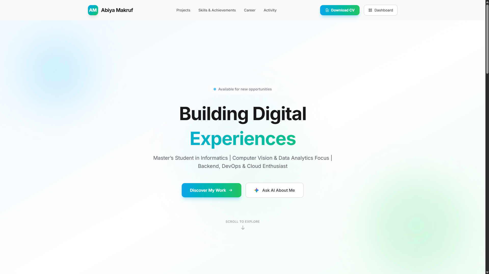
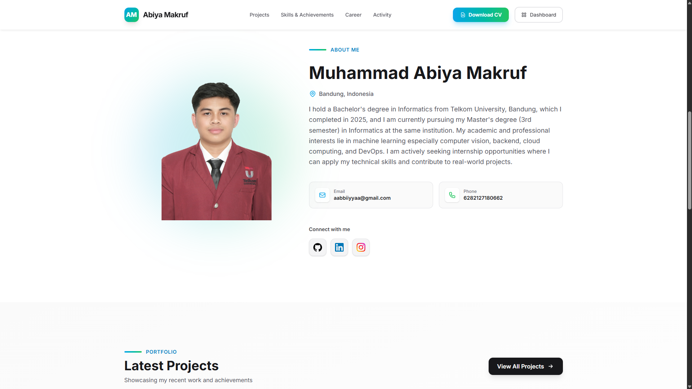
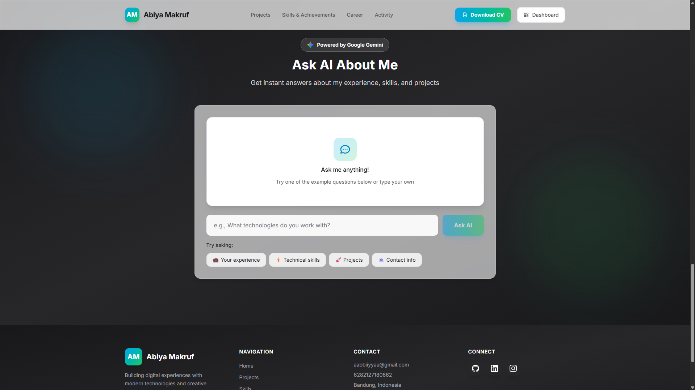
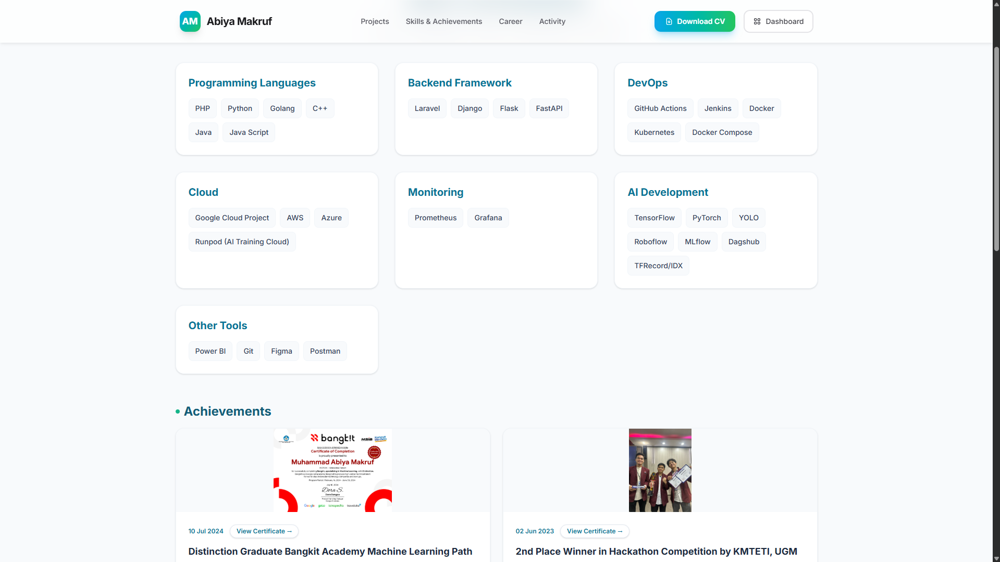
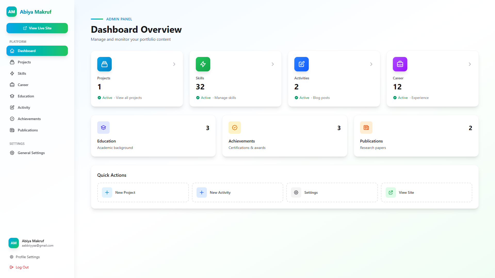

# 🚀 Portfolio Abiya Makruf
Selamat datang! Ini adalah proyek portofolio pribadi Abiya Makruf yang menampilkan halaman publik (projects, skills, career, activity) serta dashboard admin untuk mengelola konten. Dibangun dengan gaya modern, ringan dipakai, dan sudah terintegrasi AI. 🙂

## 🌐 Demo
- Live website: [https://portofolio.abiyamf.my.id/](https://portofolio.abiyamf.my.id/)

## 🔧 Tech Stack
- Laravel 12 + Livewire Flux (dashboard UI) + Vite
- Tailwind CSS + Alpine.js
- PostgreSQL sebagai basis data utama
- Google Cloud Storage untuk media (CV, gambar, video)
- PHP 8.2+, Node.js 18+ (dev tooling)

## 🖼️ Cuplikan Layar
- Landing: 
- About Me: 
- Ask AI: 
- Skills & Achievements: 
- Dashboard Admin: 

## ✨ Fitur Utama
- Kelola proyek, aktivitas, pengalaman, pendidikan, achievements, dan publikasi via admin.
- Upload CV dan seluruh aset media (thumbnail, gallery, video) langsung ke Google Cloud Storage dengan link publik otomatis.
- Gallery interaktif (gambar & video), popup detail konten, dan tombol CTA yang jelas (GitHub, Website, CV).
- Integrasi Ask AI berbasis Gemini untuk bertanya seputar profil/portofolio.
- Layout responsif: tombol Download CV & login tetap nyaman di mobile, tabel admin bisa di-scroll, dan navigasi mobile berfungsi.

## ▶️ Cara Menjalankan (ringkas)
1. `composer install` lalu `npm install`.
2. Salin `.env.example` ke `.env`, isi kredensial database + GCS (bucket, key file).
3. `php artisan key:generate` dan `php artisan migrate`.
4. `npm run build` (atau `npm run dev` untuk mode pengembangan).
5. Jalankan server: `php artisan serve` lalu akses sesuai host.

## 📝 Catatan
- Contoh CV ada di `readme/cv.pdf` (untuk referensi). Upload CV asli melalui admin agar tombol Download CV selalu mengambil file terbaru di GCS.
- Pastikan variabel GCS, database, dan kredensial AI (jika diperlukan) sudah diisi di `.env`.

Terima kasih sudah mampir! Jika ada saran atau masukan, jangan ragu untuk berbagi. 😄
