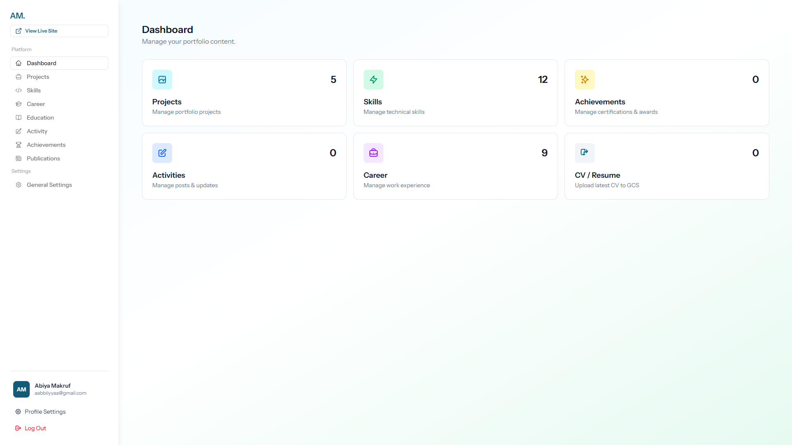
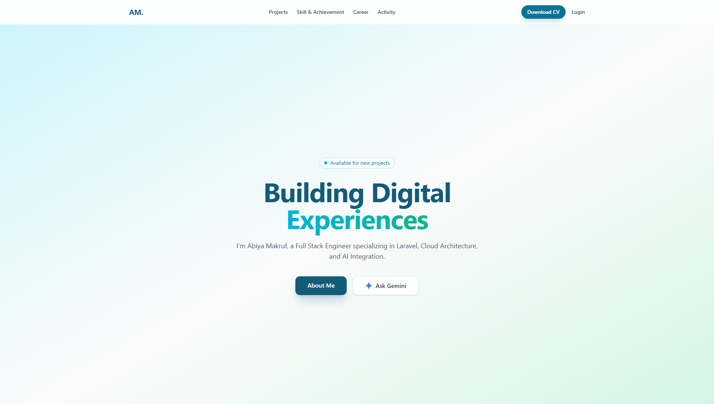

# 🚀 Portfolio Abiya Makruf
Selamat datang! Ini adalah proyek portfolio pribadi Abiya Makruf yang menampilkan halaman publik (projects, skills, career, activity) serta dashboard admin untuk mengelola konten. Dibangun dengan gaya modern dan tetap ringan digunakan. 🙂

## 🌐 Demo
- Live site: [portofolio.abiyamf.my.id](https://portofolio.abiyamf.my.id)

## 🔧 Tech Stack
- Laravel 12 + Livewire Flux (dashboard UI) + Vite
- Tailwind CSS + Alpine.js
- PostgreSQL untuk data utama
- Google Cloud Storage untuk media (CV, gambar)
- PHP 8.2+, Node.js 18+ (dev tooling)

## 🖼️ Cuplikan Layar
- Admin: 
- Public: 

## ▶️ Cara Menjalankan (ringkas)
1. `composer install` lalu `npm install`.
2. Salin `.env.example` ke `.env`, isi kredensial database dan GCS.
3. `php artisan key:generate` dan `php artisan migrate`.
4. `npm run build` (atau `npm run dev` untuk mode pengembangan).
5. Jalankan server: `php artisan serve` kemudian akses sesuai host.

## ✨ Fitur Utama
- Kelola proyek, aktivitas, pengalaman, pendidikan, achievements, dan publikasi via admin.
- Upload CV/asset ke Google Cloud Storage dengan link publik otomatis.
- Layout responsif, termasuk bottom nav dan tombol download CV di mobile.

Terima kasih sudah mampir! Jika ada saran atau masukan, jangan ragu untuk berbagi. 😄
